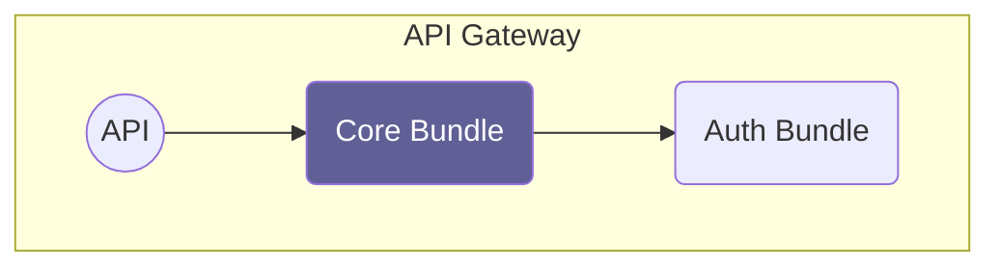

# About

The core bundle is the central bundle that needs to be installed in every API
gateway and also is a dependency of every other API bundle.

* It provides functionality that is commonly needed by API bundles (error handling,
  logging, etc)
* It integrates the auth bundle with the Symfony security system
* It provides console commands that API bundles can subscribe to
* It configures all dependencies to our needs (api-platform, symfony, etc.)
* and more ...

# Overview

A minimal working relay API gateway consists of the core bundle and an auth bundle.

### Auth Bundle

The auth bundle takes care of user authentication and communicates with an OIDC
server, for example [Keycloak](https://www.keycloak.org). It creates the Symfony
user object and converts OAuth2 scopes to Symfony user roles used for
authorization.
